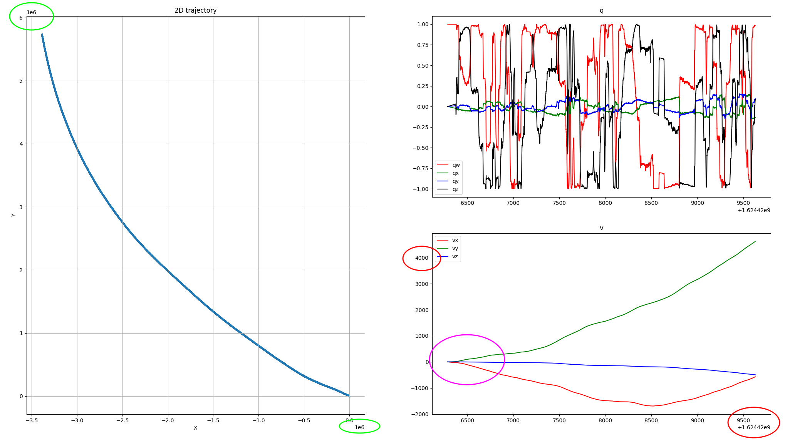
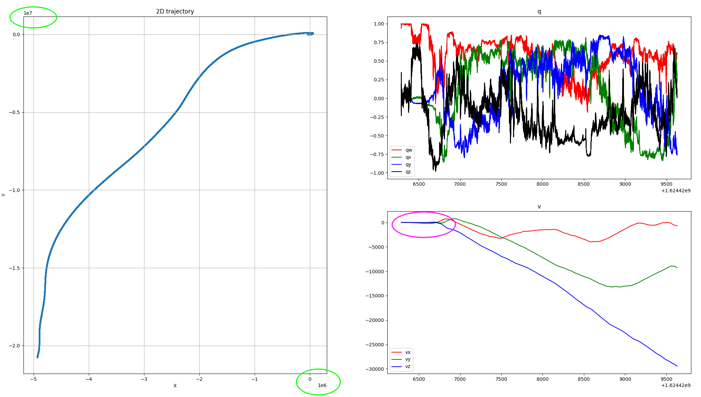

# 将基于李群的姿态递推，替换为基于EKF的纯IMU姿态递推

详见函数InitStateForIMUPose()

原程序结果：

改动后程序结果：

问题：可以看到一开始的时候速度并没有马上发散，维持了一段时间之后才发散。
但是！！！右上的姿态变换却更不稳定了，而且最终位姿和速度发散的程度更大了！！ —— TODO
对于EKF过程中的测量协方差我是随意填写的数字

# 加入初始化
将世界坐标系的Z轴转到正下，也会有影响。
简单取平均，做向量之间的旋转计算——详见函数InitState()

# 疑问
对于PVQ的递推，因为P和V都和Q有关，所以一般先更新Q，然后用更新后的Q计算P和V。
高博原程序直接是顺序PVQ的递推，我尝试改动，肉眼观察的话发现结果并没有什么变化。但是我觉得还是应该Q先后PV的顺序应该比较合理